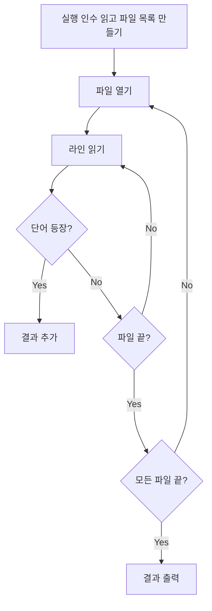

# 1. 단어 검색 프로그램 만들기

```mermaid
  flowchart TD
      A[실행 인수 읽고 파일 목록 만들기] --> B[파일 열기] --> C[라인 읽기] --> D{단어 등장?}
      D --> |Yes| E[결과 추가]
      D --> |No| F{파일 끝?}
      F --> |No|C
      F ---> |Yes|G{모든 파일 끝?}
      G --> |No|B
      G --> |Yes|H[결과 출력]
```
